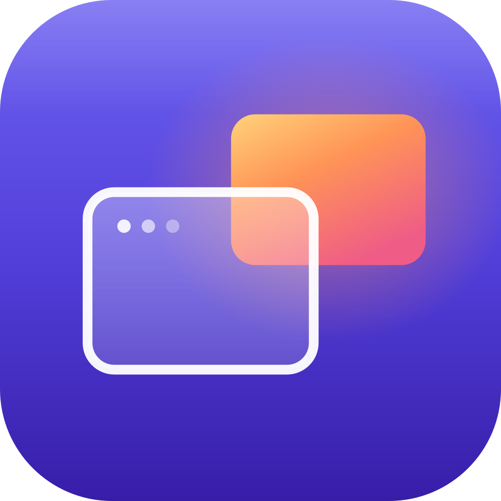

<p align="center">
  
</p>

# RDPeek

A native macOS remote desktop client built on
[RDPKit](https://github.com/steelbrain/RDPKit), with a connection-center
experience in the spirit of Microsoft's "Windows App" — but pure Swift,
lightweight, and Mac-first. Home: [rdpeek.com](https://rdpeek.com).

- **Connection Center** — a searchable grid of saved PCs with per-device
  gradient tiles, play-to-connect, context menus, and sort by name or
  recent use
- **Full-bleed sessions** — edge-to-edge video under a transparent titlebar,
  with an animated connecting overlay, a status pill, and a session menu
- **Hardware-decoded video** — H.264 (AVC420/AVC444) and HEVC via
  VideoToolbox, presented on the display link for smooth pacing
- **No resolution fiddling** — the remote desktop starts at your screen's
  size and follows the window as you resize, HiDPI aware
- **Your keyboard, their shortcuts** — while a session has focus, ⌘ and ⌃
  chords go to the remote desktop (⌘ maps to the Windows key, so ⌘R is
  Win+R), and modifier state survives focus changes without sticking
- **Clipboard both ways** — text and files (up to 32 MiB), always-on,
  one-shot sync, or time-boxed 30-second sharing
- **Remote audio** — optional RDPSND playback
- **Credentials done right** — passwords live in your Keychain (or in
  memory for the current run only), and sessions that need a password
  ask with an in-window sign-in instead of failing
- **Stats for Nerds** — a full protocol and rendering diagnostics window,
  plus an in-session performance overlay chip

## Install

Download the latest signed and notarized build from
[Releases](https://github.com/steelbrain/RDPeek/releases/latest).
Requires macOS 14.0 or later. Free and open source.

## Using the App

1. Click **Add PC** (or press **⌘N**) and enter a host. Name, credentials,
   clipboard, and audio are all optional and editable later.
2. **Double-click a card** (or hover and hit the play button, or select it
   and press **Return**) to connect. If no password is stored, the session
   window asks you to sign in.
3. The session window opens maximized; the remote desktop re-fits whenever
   you resize the window. The **⋯ menu** in the titlebar holds clipboard,
   audio, and display controls, the performance overlay, and Stats for
   Nerds.

Press **⌘?** in the app for the full shortcut list and usage details.

## Building from Source

Requirements: Xcode 16+ (Swift 6) and
[XcodeGen](https://github.com/yonaskolb/XcodeGen) to generate the project
(the `.xcodeproj` is not committed).

```sh
xcodegen generate
xcodebuild -project RDPeek.xcodeproj -scheme RDPeek \
  -destination 'platform=macOS' -derivedDataPath DerivedData build
open "DerivedData/Build/Products/Debug/RDPeek.app"
```

Or open `RDPeek.xcodeproj` in Xcode after generating and run the `RDPeek`
scheme. Run the test suite with `xcodebuild test` using the same flags;
warnings are errors, and `swiftlint lint --strict` must stay clean. CI runs
lint, an unsigned build, and the tests on every push and pull request.

## Project Layout

```text
project.yml               XcodeGen manifest (app + unhosted unit-test bundle)
Sources/App/              App entry, scenes, commands, settings, theme
Sources/ConnectionCenter/ Device grid, cards, editor sheet, list model
Sources/Session/          Session window, view controller, canvas, input, HUD
Sources/Diagnostics/      Stats for Nerds window
Sources/Storage/          Device profiles, Keychain, trusted certificates
Sources/Resources/        Asset catalog and the app-icon pipeline
Tests/                    Unit tests (input state, stores, session gating)
website/                  rdpeek.com (Next.js, deployed on Vercel)
```

The connection, clipboard, display-control, audio, and credential logic in
`Sources/Session` is adapted from RDPKit's example client, which is the
reference implementation for driving `RDPPreflightClient`.

Contributing? [AGENTS.md](AGENTS.md) documents the conventions this repo
holds itself to — layer boundaries, build and lint gates, and commit style.

## License

MIT. See [LICENSE](LICENSE).
